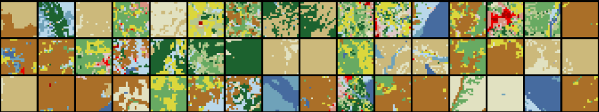

# GPT Modeling for Land Use / Land Cover

This repository is a [fork of the RandAR modeling codebase](https://rand-ar.github.io/) adapted to take the RandAR decoder-only autoregressive model for simulating land use / land cover data. At a high level, this repository implements a GPT-like model that is trained on land cover data of randomized order in which positional tokens are included with each data token to indicate its spatial origin. This allows for generation of new tokens out of order, which is useful for tasks like fill-in-the-middle or inpainting. Note that this repository does not use the LlamaGen tokenizer of the original RandAR work. Currently, this project works with discrete 2D data directly without a preliminary tokenization stage.

To use this codebase, follow these steps:

- Clone the repository, create a virtual env and install the dependencies using `pip install -e .`.
- Download the required land cover data file `nlcd_2021_land_cover_l48_20230630.img` from [here](https://www.usgs.gov/centers/eros/news/nlcd-2021-now-available) and place it in the `data/` directory
- (Optionally) set your `AWS_ACCESS_KEY_ID` and  `AWS_SECRET_ACCESS_KEY` environment variables to back up processed data and model artifacts to AWS s3
- Run the script located at `scripts/prep-dataset.ipynb` to produce a dataset in `npz` format in the `data` directory
- Make sure the dataset path is correctly specified in its config (YAML file located in `configs`)
- Train the model using `accelerate launch train.py --config configs/randar_nlcd_32.yaml`. During training, visualization results are saved in the `results/` folder. 
  - The `gen_*.png` images show new images generated entirely from scratch.
  - The `gt_*.png` images are examples of actual training data.
  - The `pred_*.png` images are produced using teacher forcing reconstruction.

- Once the model is trained, use the scripts in `scripts/` to evaluate and visualize the results.

## Data

### Data Format
The training and evaluation code requires data in a `.npz` file with keys `train_data` and `test_data`, each mapping to arrays of shape (N, C, H, W) where:
- N = number of samples
- C = number of channels (≥1, first channel must be land cover data)
- H = W = spatial dimensions (square images required)

The first channel contains integer-valued land use/land cover classes.

The `scripts/prep-dataset.ipynb` notebook implements the data cleaning pipeline. The process extracts square image patches from NLCD raster data and optionally combines them with elevation data.

The required input files are: `nlcd_2021_land_cover_l48_20230630.img`, the National Land Cover Database raster covering the continental US and optionally the SRTM elevation tiles downloaded via `elevation` in `scripts/prep-dataset.ipynb`. This script produces `.npz` files named like `data_XX.npz` where `XX` is the resolution of the data produced by the pipeline. This file has the following key/value pairs:

  - `train_data`: Training samples array with shape `(N_train, 2, XX, XX)`
  - `test_data`: Test samples array with shape `(N_test, 2, XX, XX)`
  - `train_coords`: Longitude/latitude coordinates of training samples with shape `(N_train, 2)`
  - `test_coords`: Longitude/latitude coordinates of test samples with shape `(N_test, 2)`

## Generating a new image
The code below uses a script to produce an animation of a new NLCD image being created one pixel at a time in random order.
```
python3 scripts/nlcd_animation.py --config configs/randar_nlcd_32.yaml --gpt-ckpt results_nlcd_32/randar_nlcd_32/checkpoints/final --output-file generation_2x2.gif --device cuda --nrows 2 --ncols 2 --size 32
```



## Scripts

The `scripts/` directory contains utilities for training, evaluation, and visualization as summarized below:

| Script Name | Output | Example Command |
|------------|---------|-----------------|
| `eval-compare-information.py` | Compares information content between language and land cover data using entropy metrics | `python scripts/eval-compare-information.py --text-path data/tiny_shakespeare.txt --config configs/randar_nlcd_32.yaml` |
| `eval-inpaint-single.py` | JSON file for single masking level with inpainting accuracy metrics and optional visualization plots | `python scripts/eval-inpaint-single.py --config configs/randar_nlcd_32.yaml --gpt-ckpt results_nlcd_32/randar_nlcd_32/checkpoints/final --n-images 100` |
| `eval-perplexity.py` | Perplexity evaluation results for the model on NLCD data | `python scripts/eval-perplexity.py --config configs/randar_nlcd_32.yaml --gpt-ckpt results_nlcd_32/randar_nlcd_32/checkpoints/final --n 1000` |
| `eval-zip-info-content.py` | Compression ratio comparison between NLCD and Wiki data | `python scripts/eval-zip-info-content.py` |
| `plot-inpaint-evals.py` | Plot of inpainting accuracy vs mask ratio | `python scripts/plot-inpaint-evals.py` |
| `viz-embed-space.py` | Plot visualization of model embedding space using UMAP | `python scripts/viz-embed-space.py --config configs/randar_nlcd_32.yaml --gpt-ckpt results_nlcd_32/randar_nlcd_32/checkpoints/final --n-embeddings 100` |
| `viz-prob-dev-plot.py` | Plo heatmap showing probability of development from multiple samples | `python scripts/viz-prob-dev-plot.py` |
| `viz-sample-chain.py` | GIF animation of Gibbs sampling chain | `python scripts/viz-sample-chain.py --config configs/randar_nlcd_32.yaml --gpt-ckpt results_nlcd_32/randar_nlcd_32/checkpoints/final --t 100 --output-file chains.gif` |
| `inpaint-experiment.sh` | Multiple JSON files with inpainting results for different mask ratios | `bash scripts/inpaint-experiment.sh` |
| `prep-dataset.ipynb` | Processed NLCD dataset with train/test splits and DEM data | Run in Jupyter |
| `viz-wide-animation.ipynb` | Wide panoramic animation GIF with pixel reveal effect | Run in Jupyter |

More details:

The script `scripts/inpaint-eval-single.py` can be used to calculate the average accuracy of the RandAR model as applied to image inpainting with a masked rectangular region in the image interior. It can be run via a command like the following:
```
python scripts/inpaint-eval-single.py --config configs/randar_nlcd_32.yaml --gpt-ckpt results_nlcd_32/randar_nlcd_32/checkpoints/final --n-images 2000 --size 32 --verbose --save-results inpaint_eval_results.json

python scripts/inpaint-eval-single.py --config configs/randar_nlcd_32.yaml --gpt-ckpt results_nlcd_32/randar_nlcd_32/checkpoints/final --n-images 2 --verbose --save-results inpaint_eval_results.json --mask-type random --mask-ratio 0.9 --visualize
```

### Running Gibbs sampler
Part of this project assesses the autoregressive model by using it as an energy function for a Gibbs sampler. This logic is defined in `scripts/nlcd_sample-chain.py` and can be invoked with commands lke the following:
```
# Long run with multiple chains, saving data only
python scripts/sample-chain.py \
  --config configs/randar_nlcd_32.yaml \
  --gpt-ckpt results_nlcd_32/randar_nlcd_32/checkpoints/final \
  --t 20000 \
  --n-chains 5 \
  --save-array long_chains.npz \
  --frame-interval 100 \
  --device cuda

# Short run with animation
python scripts/sample-chain.py \
  --config configs/randar_nlcd_32.yaml \
  --gpt-ckpt results_nlcd_32/randar_nlcd_32/checkpoints/final \
  --t 100 \
  --n-chains 3 \
  --output-file chains.gif \
  --frame-interval 5 \
  --device cuda
```

## Operational notes:

#### Syncing entire directory with exclusions
```
source .env && aws s3 cp . s3://lc-inpaint/lc-gpt/ --recursive --exclude ".*" --exclude "*/.*" --exclude "venv/*" --exclude "__pycache__/*" --exclude "*.pyc" --exclude "*.img" --exclude "*.tif" --exclude "*.zip" --exclude "*.ige" --exclude "*/wandb/*" --exclude "old/*" --exclude "/checkpoints/*"
```
